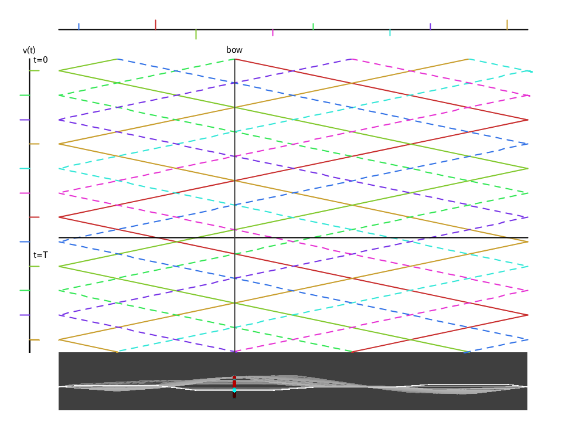
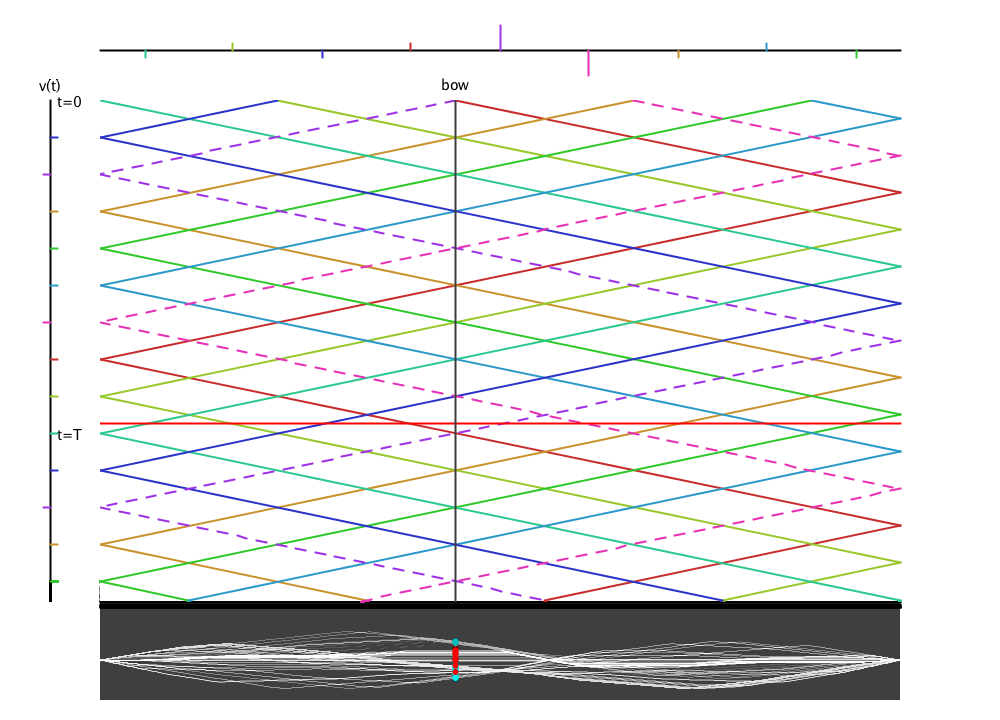

# Visualization of Helmholzian Wave Propagation with Processing

## Sample Image

## Reference

久保田秀美「弓で擦った弦の定常振動の運動学的研究」日本音響学会誌43巻5号（1987）

Kubota Hidemi "Kinematical study of the bowed string." Japan Acoustic Society Journal 43-5(1987)

## Author

by Matsuura Tomoya

<https://matsuuratomoya.com>

## License

MIT License
